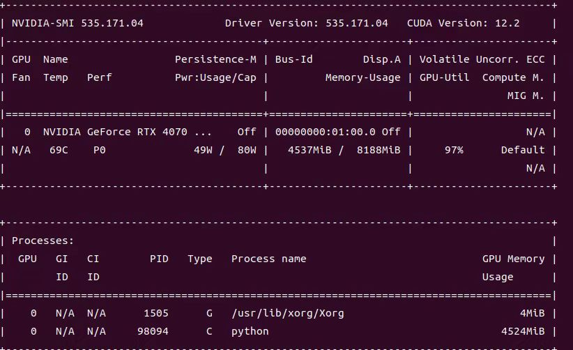

# QifengZhong-weekly-report
## week 1

1. **Learning Convolutional Neural Networks (CNN) **
   - learned CNN
   
2. **Understand key algorithms and mathematical calculations**
   - Understood PoseCNN, PoseCNN+ICP, and solved the principle and function of some basic algorithms (Hough voting, Ploss,Sloss).
   - Learned PointNet and Pointnet ++(using symmetric functions to solve the disordered transposition invariance of point clouds).

3. **** Environment configuration and deployment ****
   - A PyTorch version of the project with PoseCNN in the NVlabs repository deployed on Ubuntu 22.04 LTS (environment set up, missing pre-training parameters and data set with proper structure (connection failure in the original project)) was deployed.
   - PointNet deployed in Ubuntu 22.04, ShapeNet data set debugging (batch size 32) video memory usage:：

classification

segmentation

4.  solved
   - When the environment is configured, the version is incompatible, which is more troublesome (PoseCNN)
   - Workaround: For PoseCNN, you need to install pytorch with opencv-python == 4.2.0.34.
   - When setup (cuda version is 12.x), the corresponding pytorch version (other versions are not tried) needs to perform the following operations on lib/layers/ROIAlign_cuda.cu
   - Delete #include <ATen/ aten.h > from the file (the older version of torch is no longer used).
   - replaced: dim3 grid(std::min(THCCeilDiv(output_size, 512L)， 4096L));
   - with: dim3 grid(std::min(((int)output_size + 512 -1) / 512, 4096));
   - replaced：THCudaCheck
   - with: AT_CUDA_CHECK
5.  **others**
   - Hardware requirements?
   - Does the Motion Capture System group need (learn more about) Isaac Sim/ROS?
