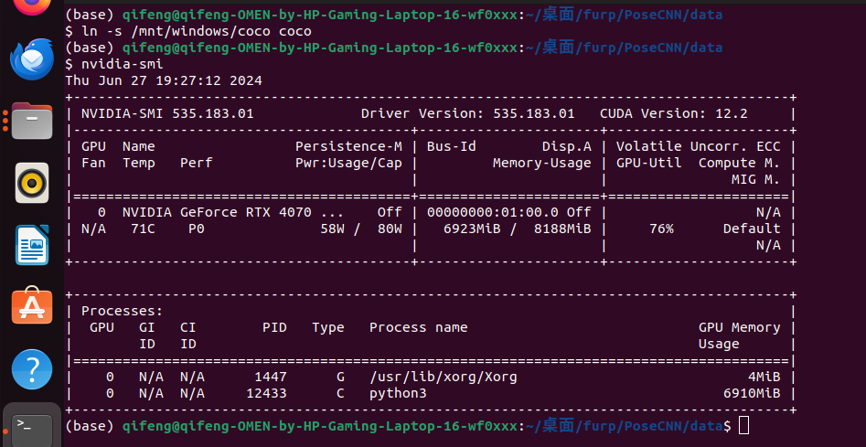
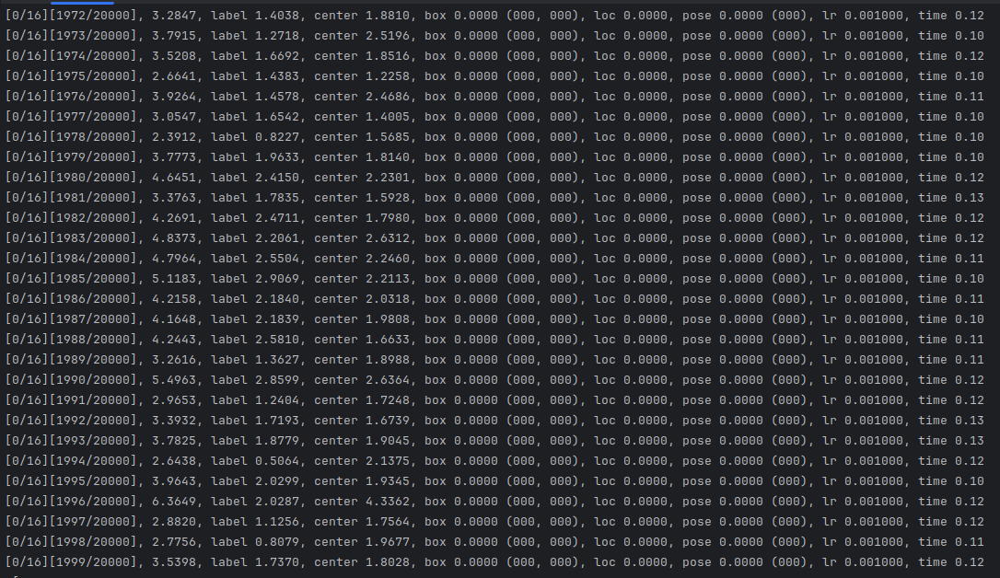
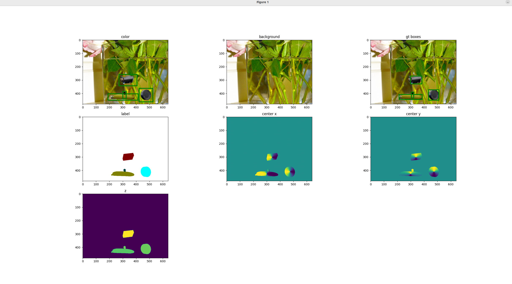
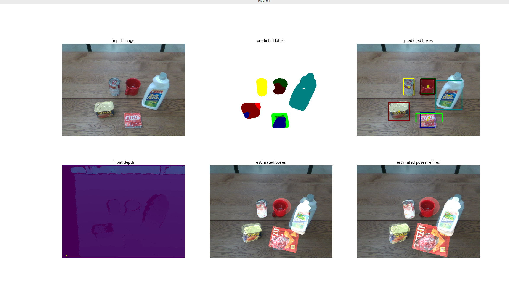

# Week2

### Done
1. **Read PoseCNN repository code**:

   1. Gained some understanding of the PoseCNN project code. 

   2. Trained on the dex-ycb dataset (setup=s0).

   2. Used [coco2014/train/train](https://cocodataset.org/#download) as the background dataset during training (0.5 probability of replacing the original background). 

   4. Pre-trained weights ([vgg16](https://download.pytorch.org/models/vgg16-397923af.pth)).

2. **Understanding data requirements (still unclear, see Unresolved Difficulties section)**:
   
   1. Required data includes: object model masks, camera intrinsics, camera extrinsics (multiple cameras), and point clouds of object models.
   2. Did not find the specific usage of camera extrinsics in the code of PoseCNN project.
3. **Understanding of project code**
   1. Currently, Understand about 10% of the project code, but there is room for improvement.
   2. Would like to mention that key points is to understand include the data reading and preprocessing in the datasets module, particularly the __init__ function and __getitem__ function, as well as the implementation of the __train__ function in __lib/fcn/train__.

4. **Results**

    Approximately 6-7 fps,

     Batch size is 1 (if set to 2, memory will be insufficient; the original project default is 2):



 At 2000 frames:





 Weights after the first epoch [checkpoint](https://drive.google.com/file/d/1MTVLZbQJKjnkJXIMnMX5M-T2DhATHbD_/view?usp=drive_link) (loss did not converge for some reason ).

And using this weight runed demo (refer to [issue4](https://github.com/NVlabs/PoseCNN-PyTorch/issues/4) if index error happend):



### Challenges (time-consuming, resolved)
1. Insufficient memory in the Linux system to accommodate the dataset

    Downloading and extracting the dataset was a painful process! The Linux system couldn't accommodate a 120GB dataset, so I bought an SSD(If your have no space on both systems windows and linux) or mounted the Windows partition on the Linux system. This solved the problem but wasted a lot of time (switching between the two systems).

2. If you encounter an error here ([in the original project](https://github.com/NVlabs/PoseCNN-PyTorch/blob/main/lib/datasets/dex_ycb.py#L151-L154)) when training...

   Refer to [issue46](https://github.com/NVlabs/PoseCNN-PyTorch/issues/46):

    The author's usage is as follows:

   ```python
   import numpy as np
   a = (0,1)
   b = np.array([1,0])
   print(b[a])
   ```

   Change it to the following to fix the error:

   ```python
   import numpy as np
   a = (0,1)
   b = np.array([1,0])
   print(b[np.array(a)])
   ```

   

### Unresolved Difficulties (very frustrating!)
1. There are many things don't understand, especially the mathematical knowledge needed, such as how to calculate the coordinates of an object in an image based on camera parameters, etc.
2. Handling npz, xyz, ply files is difficult as it's hard to understand the meaning of the stored parameters.
3. The project also includes some data related to robotic arms (e.g., joint points for grasping objects). Applying this project (PoseCNN) fully to ongoing project (motion capture) is very challenging for me. Still have no clear idea of the data structure what we need.
4. Might need to write our own code (interface) for data processing to apply PoseCNN to our ongoing project, which requires a deep understanding of network structure and algorithm.
5. Given that VGG focuses on classification tasks, a bold idea is to replace VGG16 in PoseCNN with another network (which might be somewhat impractical).


